# WALKTHROUGH
This guide describes a step by step procedure in order to automate the interaction between a smart device (e.g. bulb, plug, camera, etc...) and the android app that manages it (e.g. switch on or off a bulb, change the color hue of the bulb, switch on or off a plug, scheduling of actions).
\
\
**GOAL: Create an android UI Automator test able to run for days without stopping in order to collect a sufficient amount of data through the router Wi-Fi sniffer device Linksys3200 located in the AntLab laboratory.**
\
\
**LEGEND:** In this guide, using bash syntax we have defined an env variable to identify the project name `PROJECTNAME="..."`. To call the ENV var we will use `${PROJECTNAME}` and `${PROJECTNAME,,}`. This second call is used to copy a lower case version of the ENV var content. When you are going to see this 2 placeholders `${PROJECTNAME}` and `${PROJECTNAME,,}` remember that you have to put the name that you have chosen or you will choose for your project, when you will create it.
\
\
The steps are the following:

## 1. DEPENDENCIES INSTALLATION
Download and install the following tools for your platform:
- [Java SE Development Kit 8u202 link](https://www.oracle.com/java/technologies/javase/javase8-archive-downloads.html) (create an account on oracle website if you haven't done yet [Oracle Website Signon link](https://login.oracle.com/mysso/signon.jsp)). This tool is needed by uiatomatorviewer. You can also decide to install jopenjdk 11 for developing purposes.
- [Java SE Development Kit 11.0.17] (https://www.oracle.com/java/technologies/javase/jdk11-archive-downloads.html) (create an account on oracle website if you haven't done yet [Oracle Website Signon link](https://login.oracle.com/mysso/signon.jsp)). OPTIONAL INSTALLATION FOR DEVELOPING PURPOSES WITH ANDROID STUDIO. YOU CAN ONLY DECIDE TO USE JAVA 8. IT'S UP TO YOU. 
- [Git link](https://git-scm.com/downloads)
- [Android Studio link](https://developer.android.com/studio)

## 2. EMULATOR CREATION
Create a AVD qemu device compatible with Google Play Store and x86-64 processors, otherwise we cannot download the app needed from the Play Store. 
- Open Android Studio
  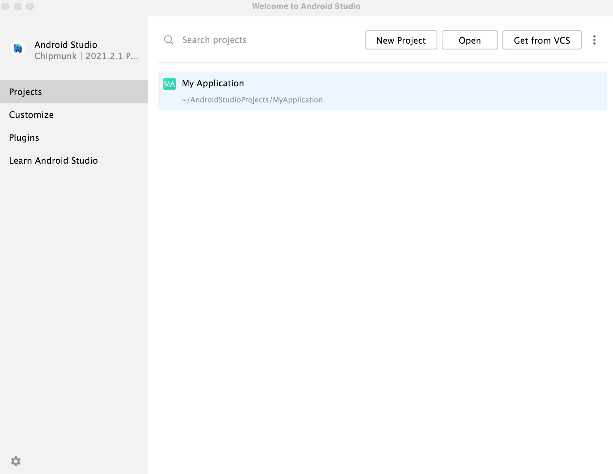
- If you don't see the Welcome to Android Studio Window go to File > Close Project.
  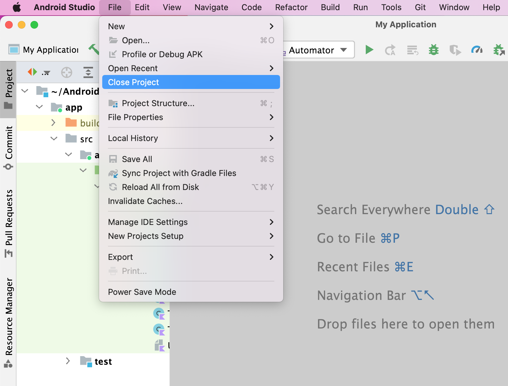
- From the three point dropdown menu select SDK Manager
  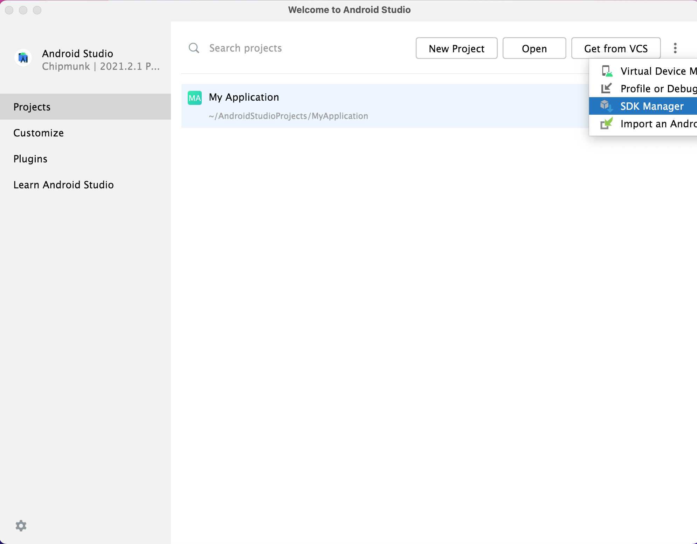
  - Select SDK Platforms TAB. Check Show Package Details in the right bottom of the window. Search and Open Android 12.0 (S) menu. Check Android SDK Platform 31, Sources for Android 31, `Google Play Intel x86 Atom_64 System Image`
    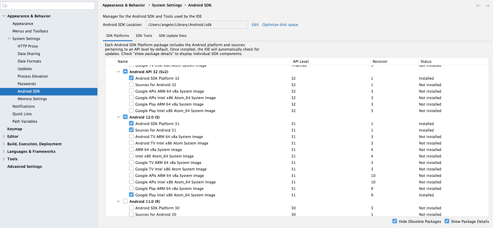
  - Switch to SDK Tools TAB. Check (if not so) Android SDK Build-Tools, Android SDK Command-line Tools, Android Emulator, Android SDK Platform-Tools.
    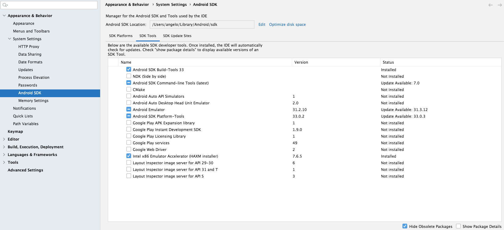
  - Finally Apply the changes and wait till Android Studio have downloaded and installed all the binaries needed.
- Open Android Studio and from the three point dropdown menu select Virtual Device Manager
  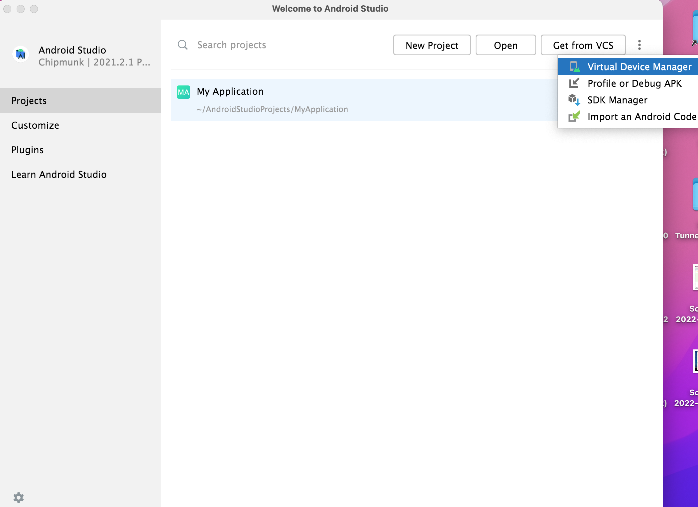
  - [OPTION 1 ] Create device: Select Phone TAB on the Right Category vertical menu. Select Pixel 2 (recommended, but nothing avoids you to select another device). Pay attention to see the image of the Play Store in the second column named Play Store. Click Next. Select Recommended Tab. Select row `S,31,x86_64,Android 12.0(Google Play)` in the table menu. Give a name to the emulator (e.g. Automator). Click Show Advanced Settings. In the Camera Section set Front to None and Back to None. In the Emulated Performance section select Cold Boot as Boot Option. In Memory and Storage set 4096 as RAM, 512 as VM Heapi, 2048 MB as Internal Storage and 512 MB as Studio Managed SD Card. In Device Frame, check the checkbox Enable Device Frame and select no skin in the dropdown menu. Click Finish and wait that Android Studio builds and creates the emulator.
    - Start the emulator
    - Open Play Store and sign in with a valid google account. Create it if you haven't one.
    - Download from the Play Store the app needed (e.g. Tapo, EZVIZ) and **place it in the home emulator screen**.
    - Open the app. Sign in. Associate the Smart Device to the Wi-Fi LinkSys of the lab. ROUTER NAME: LinksysAC3200.
    - Adjust time in the settings putting Rome timezone GMT+2
  - [OPTION 2 ] Create device: Select Phone TAB on the Right Category vertical menu. Select Pixel 2 (recommended, but nothing avoids you to select another device). Pay attention to see the image of the Play Store in the second column named Play Store. Click Next. Select 'x86 Images' tab. Select row `S,31,x86_64,Android 12.0(Google APIs)` in the table menu. Give a name to the emulator (e.g. Automator). Click Show Advanced Settings. In the Camera Section set Front to None and Back to None. In the Emulated Performance section select Cold Boot as Boot Option. In Memory and Storage set 4096 as RAM, 512 as VM Heapi, 2048 MB as Internal Storage and 512 MB as Studio Managed SD Card. In Device Frame, check the checkbox Enable Device Frame and select no skin in the dropdown menu. Click Finish and wait that Android Studio builds and creates the emulator.
    - Start the emulator
    - Download from your laptop the apk files of the apps needed exploiting [apkmirror](https://www.apkmirror.com/) or [apkpure](https://apkpure.com/) (e.g. Tapo, EZVIZ) and **place it in the home emulator screen**.
    - Install the app inside the emulator exploting the following terminal command: ` cd ${FOLDER}; adb install app.apk`, where `${FOLDER}` is the path where the apk file is stored inside your local laptop. On the screeen of the emulator you will see the result of the installation.
    - Open the app. Sign in. Associate the Smart Device to the Wi-Fi LinkSys of the lab. ROUTER NAME: LinksysAC3200.
    - Adjust time in the settings putting Rome timezone GMT+2

## 3. ROUTER - SMART DEVICE ASSOCIATION
Plug in the smart device to a power source. Download the app related to the device on your personal phone. Connect your phone to the Linksys3200 using the password provided by Fabio or Angelo. Login in the app. Follow the procedure to associate the smart device to the router (as written above, it is advisable to use your personal phone to associate the device to the router). It is needed a physical phone since exploiting directly the emulator does not work for smart device association phase to local wifi network.

## 4. ENVIRONMENT VARIABLE SETTINGS
Set the following ENV variables in order to use: *uiautomatorviewer*, that is the tool that we will use to collect pixels positions, text strings and resourceid strings information in order to orchestrate the automatic test.

### How to open your default terminal app
Search in your laptop for an application called 'terminal' or 'command prompt' exploiting also the search bar.

### On Windows system
- Open the Start menu by pressing the "Windows Key".
- Type "Environment variables" and click on the "Edit the system environment variables" result.
- Click the "Environment variables" button under the "Advanced" tab.
- You can either create a User Variable or a System Variable
- User variable: available to only that specific user.
- System variable: available to all users including the system programs.
- To create a user variable, click "New" under the "User Variables" section.
- To create a system variable, click "New" under the "System Variables" section.
- The Variables to add are as follows:
  - `ANDROID_SDK=%USERPROFILE%\AppData\Local\Android\Sdk`
  - `JAVA_HOME=C:\Program Files\Java\jdk1.8.0_202`
  - add to PATH var:
    - `%ANDROID_SDK%\platform-tools\`
    - `%ANDROID_SDK%\build-tools\33.0.0\`
    - `%ANDROID_SDK%\tools\bin\`
    - `%ANDROID_SDK%\emulator\`
    - `%ANDROID_SDK%\cmdline-tools\7.0\bin`
- Now, type the variable name in the first field. Make sure the name has no spaces or special characters.
- Next, type the variable value in the second field. For example, to open a folder, you have to enter its path in the Value field.
- Click "Ok" to add the environment variable.
- Click "Ok" in the environment variables window.
- In the main window, click "Apply" and "Ok" buttons.
- That's all. From now on, you can use the custom variable from the Command Prompt window or Run window. 

### On Unix system
``` bash
open .bash_profile or .zshrc in your ${HOME} directory using your favourite IDE.
 
# ANDROID SDK
export ANDROID_SDK="${HOME}/Library/Android/sdk"
BUILD_TOOLS_LATEST="$(ls -1r ${ANDROID_SDK}/build-tools/ | head -n1)"
CMDLINE_TOOLS_LATEST="$(ls -1r ${ANDROID_SDK}/cmdline-tools/ | head -n1)"

# ANDROID COMMAND LINE TOOLS
export PATH="${ANDROID_SDK}/platform-tools:${ANDROID_SDK}/build-tools/${BUILD_TOOLS_LATEST}:${ANDROID_SDK}/emulator:${ANDROID_SDK}/cmdline-tools/${CMDLINE_TOOLS_LATEST}/bin:${PATH}"

uiautomator() {
        export JAVA_HOME="/Library/Java/JavaVirtualMachines/jdk1.8.0_112.jdk/Contents/Home"
        export PATH="${ANDROID_SDK}/tools/bin:${PATH}"
        uiautomatorviewer
}
```

## 5. UIAUTOMATORVIEWER EXECUTION 
Inspect the new application to test through the tool *uiautomatorviewer*. (start the emulator before this step)
\
uiautomatorviewer PATH:
- Unix systems: `${ANDROID_HOME}/tools/bin/uiautomatorviewer` or `uiautomator` 
- Windows systems: `%ANDROID_HOME/tools/Uiautomatorviewer.bat` or `uiautomatorviewer`
  \
  This is the main page of the tool:
  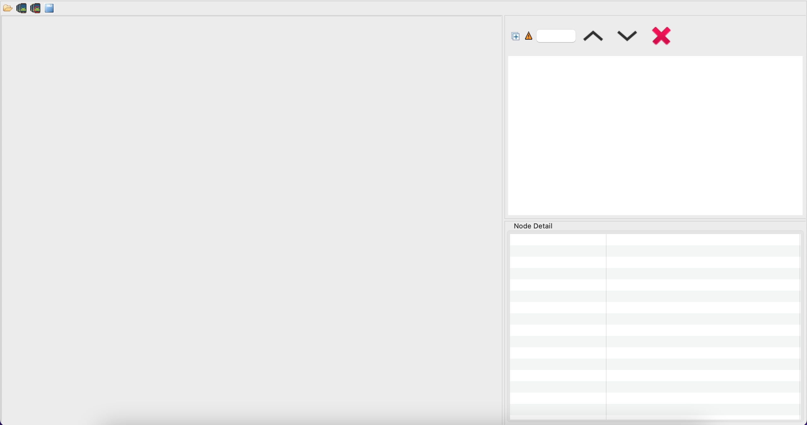
  This is the element that you should click in order to get the emulator screen to inspect:
  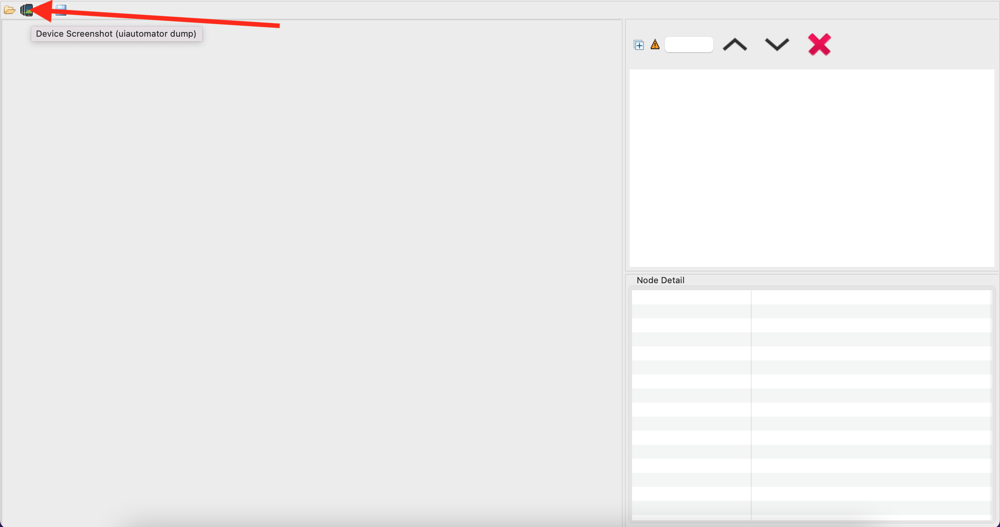

## 6. UIAUTOMATORVIEWER INSPECTION
Collect the main actions (the selectors) that must be automated using *uiautomatorviewer*.
\
Elements could be selected hovering with the mouse on top of them (there will be a red square that follows the mouse on the element currently inspected). Finally click on the element for which you want to get any information.

\
You have to find all the events in the app that change the state of the bulb (on/off, change of color hue, color temperature, pre-defined modes,etc...)
\
We suggest to follow the next hierarchical order of ids for each graphical element that you need to map in your kotlin smart device class:
1. Resource ID (unique)
   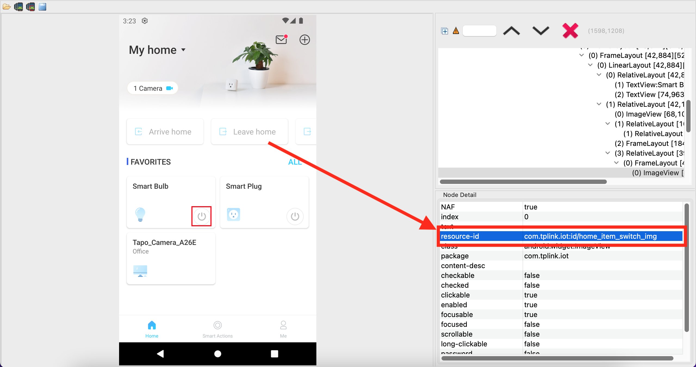
2. Text Labels
   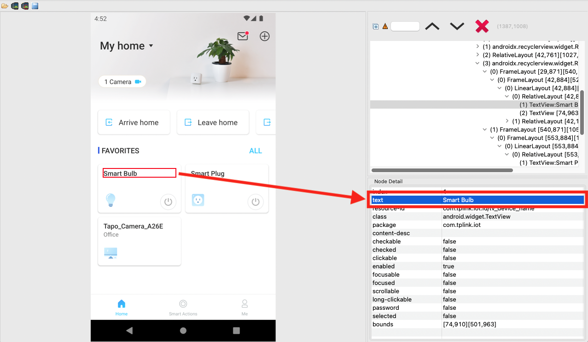
3. Pixels position of corner in the top left angle and in the bottom right angle `[P1xP2]x[P3xP4]` of the element selected. P1 and P2 are the x and y coordinate of top left angle. P3 and P4 are the x and y coordinate of bottom right angle.
   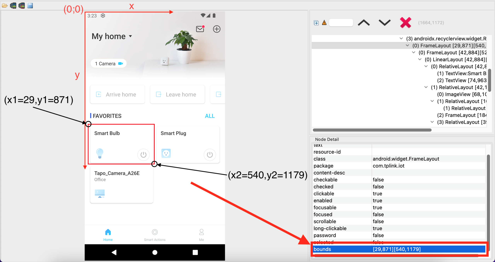
* Package names (special case)
* Class names (special case)

## 7. ANDROID STUDIO PROJECT CREATION
Open Android Studio and create a new project.
If you don't see the Welcome to Android Studio Window go to File > Close Project.
\
Then, follow the following list:
- Click New Project
- Select Phone and Tablet
- Select  No Activity/Empty Activity
- Name: `${PROJECTNAME}`, Language: Kotlin, Minimum SDK: API:31 Android 12.0 (S)
- Click Finish and wait till Android Studio builds the project just created.
- Select Project Tab.
  \
  Modify the following files
- Android -> Gradle Scripts -> build.gradle (Module: `${PROJECTNAME}`.app)
  ```
  defaultConfig {
      applicationId "com.example.${PROJECTNAME,,}"
      minSdk 31
      targetSdk 32
      versionCode 1
      versionName "1.0"
  
      testInstrumentationRunner "androidx.test.runner.AndroidJUnitRunner"
  }
  
  compileOptions {
      //sourceCompatibility JavaVersion.VERSION_1_8
      //targetCompatibility JavaVersion.VERSION_1_8
      //sourceCompatibility JavaVersion.VERSION_1_11
      //targetCompatibility JavaVersion.VERSION_1_11
  }
  
  dependencies {
      implementation 'androidx.core:core-ktx:1.8.0'
      implementation 'androidx.appcompat:appcompat:1.4.2'
      implementation 'com.google.android.material:material:1.6.1'
      testImplementation 'junit:junit:4.13.2'
      androidTestImplementation 'androidx.test.ext:junit:1.1.3'
      androidTestImplementation 'androidx.test.espresso:espresso-core:3.4.0'
      androidTestImplementation 'androidx.test:runner:1.4.0'
      androidTestImplementation 'androidx.test:rules:1.4.0'
      androidTestImplementation 'androidx.test.uiautomator:uiautomator:2.2.0'
  }
  ```
- Android -> manifests ->  AndroidManifest.xml
  ``` xml
  <?xml version="1.0" encoding="utf-8"?>
  <manifest xmlns:android="http://schemas.android.com/apk/res/android"
      package="com.example.${PROJECTNAME,,}">
      <uses-permission android:name="android.permission.WRITE_EXTERNAL_STORAGE" />
      <uses-permission android:name="android.permission.READ_EXTERNAL_STORAGE" />
      <uses-permission android:name="android.permission.INTERNET" />
  
      <application
          android:preserveLegacyExternalStorage="true"
          android:requestLegacyExternalStorage="true"
          android:allowBackup="true"
          android:icon="@mipmap/ic_launcher"
          android:label="@string/app_name"
          android:roundIcon="@mipmap/ic_launcher_round"
          android:supportsRtl="true"
          android:theme="@style/Theme.${PROJECTNAME}" />
  </manifest>
  ```
- We will use the Android -> app -> java -> `com.example.${PROJECTNAME,,}` (AndroidTest) directory to create the classes needed and to launch the test on our device.  ExampleInstrumentedTest.kt is the file that we will use to launch our test.

## 8. ANDROID STUDIO KOTLIN CLASS CREATION
Create the classes needed for our automated test. To create a new class in Android Studio:


Create a Utils.kt class with the content of the inspection done with the *uiautomatorviewer* at point (#6.).
\
Here an explanation of the main elements in the class:
- **SmartObjPkg:** to store app package names.
- **SmartObjState:** to store object state ON/OFF. This is recommended if the app can turn on/off the state of the device as with bulbs or plugs. This is not always necessary with cameras.
- **SmartObjModel:** to store smart device object model information  
- **SmartObjApp:** to store the textlabel name of the app found in UIAutomatorViewer when you inspect the android home screen.
  \
  Example Tapo
  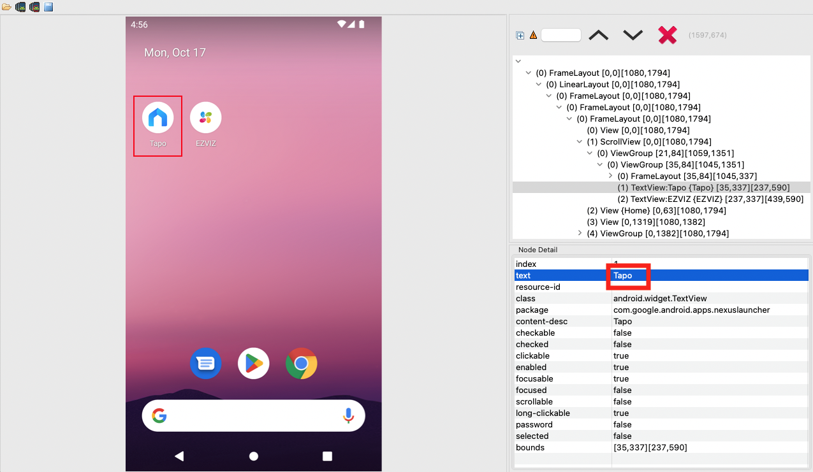
  \
  Example EZVIZ
  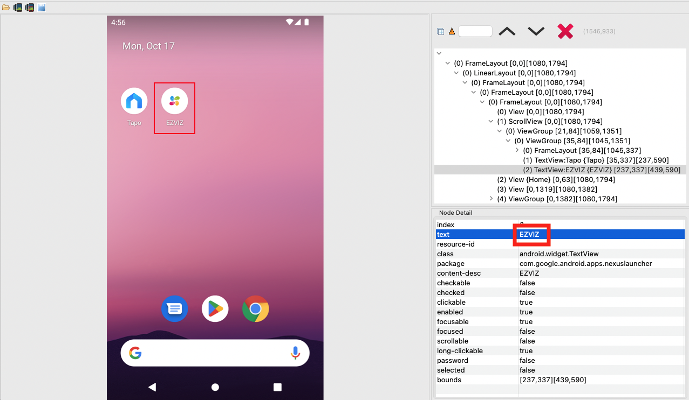
  \
  You have to put that string (case sensitive inside this enum class). It will be used to open the App.
  \
  The second stored info is the app package name found in UIAutomatorViewer by inspecting a specific app View Frame Layouts.
- **SmartObjDevice:** to store smart device type (e.g. bulb, plug, camera, etc..).
- **SmartObjDelay:** to store developer defined delays between views, actions and events, set by empirical trials. 
- **SmartObjCoord:** to store pixel positions.
- **SmartObjClassName:** to store class names.
- **SmartObjResourceId:** to store resource identifiers.
- **SmartObjTextSelector:** to store textlabels.
- **gtfile:** to store the file groundtruth file name.
- **writeGroundTruthFile:** function that write the event in the groundtruth file.
- **`SMARTOBJ_EVENT_NUMBER`:** to store the progressive counter for generated events starting from 1.
- **`SMARTOBJ_EVENT_ITERS`:** to store the total number of events to generate. 1500 events are approximately 24 hours of test running.

#### Example Utils.kt [link](https://github.com/rhacrsse/mozart-orchestrator/blob/main/app/src/androidTest/java/com/example/myapplication/Utils.kt)

You can use the following template to edit (The 3 dots refers to elements that must be edited, to add a new element the syntax is `ELEMENT_KEY("ELEMENT_VALUE")`, the only exception is SmartObjCoords with the syntax `EZVIZ_SMARTBULB_COLOR_BTN(Pair(x1,y1),Pair(x2,y2))`):
``` java
// PACKAGE NAME
package com.example.${PACKAGENAME,,}

// KOTLIN/JAVA LIBRARIES
import android.os.Environment
import java.io.File
import java.io.IOException
import java.nio.file.Files
import java.nio.file.Paths
import java.time.LocalDateTime
import java.time.format.DateTimeFormatter

/*
 *
 * CONST DEFINITION
 *
 * This class embodies variables, functions and parameters common to all the smart objects classes
 * All the enum classes values have been got from UIAutomatorViewer tool.
 *
 */

// Smart Object Package: Android GUI elements selectors based upon package names.
enum class SmartObjPkg(val pkgName: String) {
    ANDROID("com.google.android.apps.nexuslauncher"),
    TAPO("com.tplink.iot"),
    EZVIZ("com.ezviz"),
    ...
}

// Smart Object State: ON/OFF
enum class SmartObjStates(val state: Boolean) {
    STATE_ON(true),
    STATE_OFF(false)
}

// Smart Object Model: Is is the union of 3 elements:
//   - App used and package name of the app used.
//   - Device type.
//   - Device model.
enum class SmartObjModel(val app: SmartObjApp, val dev: SmartObjDevice, val mod: String) {
    L530E(SmartObjApp.TAPO, SmartObjDevice.SMARTBULB, "L530E"),
    LB1(SmartObjApp.EZVIZ, SmartObjDevice.SMARTBULB, "LB1"),
    P100(SmartObjApp.TAPO, SmartObjDevice.SMARTPLUG, "P100"),
    T31(SmartObjApp.EZVIZ, SmartObjDevice.SMARTPLUG, "T31"),
    C100(SmartObjApp.EZVIZ, SmartObjDevice.SMARTCAMERA, "C100"),
    ...
}

/*
 * Smart Object Application: Android GUI elements selectors based upon 2 elements:
 *   - App name. The case depends on the values got from UIAutomatorviewer text diplayed and set by the developer of the app.
 *   - App package name.
 */
enum class SmartObjApp(val appName: String, val pkg: SmartObjPkg) {
    TAPO("Tapo", SmartObjPkg.TAPO),
    EZVIZ("EZVIZ", SmartObjPkg.EZVIZ),
    ...
}

// Smart Object Device: In our scenario we had 2 types (bulbs and plugs), cameras have been defined for future works.
enum class SmartObjDevice(val dev: String) {
    SMARTBULB("Smart Bulb"),
    SMARTPLUG("Smart Plug"),
    SMARTCAMERA("Smart Camera"),
    ...
}

// Smart Object Delay: Android app delays defined between actions.
enum class SmartObjDelay(val delay: Long) {
    // It defines how often an event has to be generated (The value is expressed in ms).
    DELAY_EVENT(60000),
    // Delay introduced in order to allow the following tasks to be accomplished
    // (based on pixels elements position),
    // otherwise the window it is not already loaded in order to perform these type of tasks.
    // It defines how long the app need [to wait / to freeze] before performing an action inside a new opened screen window (The value is expressed in ms).
    DELAY_WINDOW(5000),
    // It defines how long the app need [to wait / to freeze] before performing another sequential action (The value is expressed in ms).
    DELAY_ACTION(2000)
}

/*
 * Smart Object Coordinates: Android GUI elements selectors based upon elements pixel bounds.
 * From UIAutomatorviewer it has been extracted the pair points [top left coords (x1,y1), and bottom right coords (x2,y2)].
 * e.g. EZVIZ_SMARTBULB_COLOR_BTN(Pair(x1,y1),Pair(x2,y2)) => EZVIZ_SMARTBULB_COLOR_BTN(Pair(39,256),Pair(155,371))
 */
enum class SmartObjCoord(val startP: Pair<Int,Int>, val endP: Pair<Int,Int>) {...}

// Smart Object Classname: Android GUI elements selectors based upon class names.
enum class SmartObjClassName(val cn: String) {...}

// Smart Object Resource Identifiers: Android GUI elements selectors based upon unique resource identifiers.
enum class SmartObjResourceId(val rid: String) {
    ANDROID_CONTENT("android:id/content"),
    ANDROID_MESSAGE("android:id/message"),
    ANDROID_BUTTON1("android:id/button1"),
    ...
}

// Smart Object Text Selector: Android GUI elements selectors based upon description text.
enum class SmartObjTextSelector(val textLabel: String) {...}

// Groundtruth log file name that will be create/updated on the emulated android device storage with the groundtruth events.
val gtfile = "gtfile.txt"

// Groundtruth log file date format
val formatter = DateTimeFormatter.ofPattern("yyyy-MM-dd HH:mm:ss.SSS")

// Function in charge of writing the groundtruth events in the log file.
fun writeGroundTruthFile(sFileName: String, sBody: String){
        try {
            // Environment.getExternalStorageDirectory() returns the path: /storage/emulated/0 .
            // Environment.DIRECTORY_DOCUMENTS returns Documents folder.
            val root = File(Environment.getExternalStorageDirectory(), Environment.DIRECTORY_DOCUMENTS)

            // The Path of the groundtruth log file is /storage/emulated/0/Documents/gtfile.txt .
            val gtfile = File(root, sFileName)
            when (gtfile.exists()) {
                // if the file exissts, it will be appended the event.
                true  -> { gpxfile.appendText(sBody) }
                // if the file does not exist, it will be created, and the first event row will be inserted.
                false -> { gpxfile.createNewFile(); gpxfile.writeText(sBody) }
            }
        }
        catch(e: IOException)
        {
            e.printStackTrace();
        }
}

// Function that gets the current time.
fun getTimestamp(): String {
    val current = LocalDateTime.now()

    return current.format(formatter)
}

// Get the radius considering border and torus thickness parameters.
// The semi-disk will be used for editColorTemperature method in which the UI is a torus.
// 50 px border. It is the radius of the little cursor disk.
var rhoCursorEstimate = 50

// 75 px half of the torus thickness. It is the radius of the semi-disk.
var rhoSemiDiskEstimate = 75

// Event counter
var SMARTOBJ_EVENT_NUMBER = 1

// Max events's number to be processed.
var SMARTOBJ_EVENT_ITERS = 1440 // 1440 events are about 24 hours of test running generating 1 event every 60 seconds.
```
Create the class needed to automate the behaviour of your app on your emulator in relation to the state of the smart device.

#### Example TapoSmartBulb.kt [link](https://github.com/rhacrsse/mozart-orchestrator/blob/main/app/src/androidTest/java/com/example/myapplication/TapoSmartBulb.kt)

We used the convention `APPNAME + SMART_OBJECT_TYPE + ".kt"` for the name of the class. In this example `"Tapo" + "SmartBulb" + ".kt"`
\
To create the class follow these advices:
- Create a method (start with fun keyword) for each interaction.
  \
  e.g. In the case of Tapo Smart Bulb we have collected the following events to implement:
  - Open Favourites Tab + Open SmartBulb window (fun openSmartBulb) => TRANSITION ELEMENT
  - Turn On the bulb (fun turnOn) => CHANGING SMART DEVICE STATE
  - Turn Off the bulb (fun turnOff) => CHANGING SMART DEVICE STATE
  - Increase Bright of Bulb (fun increaseBrightSlider) => CHANGING SMART DEVICE STATE
  - Decrease Bright of Bulb (fun increaseBrightSlider) => CHANGING SMART DEVICE STATE
  - Increase Color Temperature (fun increaseColorTemperature) => CHANGING SMART DEVICE STATE
  - Decrease Color Temperature (fun decreaseColorTemperature) => CHANGING SMART DEVICE STATE
  - Change Color Hue (fun editColor) => CHANGING SMART DEVICE STATE
  - Change Color using pre-defined colors (fun setPresetColor) => CHANGING SMART DEVICE STATE
  - Enable a pre-defined specific way in which the bulb changes color intensity and color hue (fun enablePartyTheme) => CHANGING SMART DEVICE STATE
  - Enable a pre-defined specific way in which the bulb changes color intensity and color hue (fun enableRelaxTheme) => CHANGING SMART DEVICE STATE
  Then you can exploit the following methods that could be common to whatever possibile scenario:
  - fun setDelay (used to introduce a delay among interactions/actions so that the emulator does not crash and it is able to do all the actions.
  - fun launchSmartApp (to open your app from android home screen).
  - fun pressBackButton (to go page on the previous visited window)
  You have to define a method for each event that you have found with the inspection using *uiautomatorviewer* at (#6.).
  \
  There are basically 4 operations to consider in order to accomplish each action
  1. Click a button on the screen using resource id. The syntax is:
     <br/>
     `RESOURCE_ID is the value set in Utils.kt for the element that you want to click.`
     <br/>
     `device.findObject(UiSelector().resourceId(RESOURCE_ID)).click()`
     <br/>
     <br/>
     
  2. Click a button on the screen using pixels. The syntax is:
     <br/>
     `PIXEL_X is the x coordinate of the center of the element that you want to click. There is a utility function called getCenter useful to calculare the coordinates (x and y) of the center of the elements to click.`
     <br/>
     `PIXEL_Y is the y coordinate of the center of the element that you want to click. There is a utility function called getCenter useful to calculare the coordinates (x and y) of the center of the elements to click.`
     `PIXEL_Y`
     <br/>
     `device.click(PIXEL_X,PIXEL_Y)`
  3. Swipe an element on the screen up/down or left/right. The syntax is:
     <br/>
     `RESOURCE_ID is the value set in Utils.kt for the element that you want to click.`
     <br/>
     `INT_VALUE is a random value between 1 and 10. You can set this value exploiting the following function SecureRandom().nextInt(11)`
     <br/>
     `device.findObject(UiSelector().resourceId(RESOURCE_ID)).swipeDown(INT_VALUE)`
     <br/>
     `device.findObject(UiSelector().resourceId(RESOURCE_ID)).swipeUp(INT_VALUE)`
     <br/>
     <br/>
     
     <br/>
     <br/>
     
  4. Drag an element on the screen. The syntax is:
     <br/>
     `RESOURCE_ID is the value set in Utils.kt for the element that you want to click.`
     <br/>
     `INT_VALUE is a random value between 1 and 10. You can set this value exploiting the following function SecureRandom().nextInt(11)`
     <br/>
     `DEST_X is the value of the x coordinate on which the cursor has to be moved.`
     <br/>
     `DEST_Y is the value of the y coordinate on which the cursor has to be moved.`
     <br/>
     `N_STEPS usually is step to 10`
     <br/>
     `device.findObject(UiSelector().resourceId(RESOURCE_ID)).dragTo(DEST_X,DEST_Y,N_STEPS)`
     <br/>
     <br/>
     
     <br/>

- Create one method for each event that changes the state of the smart device (e.g. event that switches off a bulb, event that changes color hue of a bulb, event that switches on a plug, event that changes a camera position, event that switches off a camera, etc...). In that method you have to put all the source code necessary to change that state, so if in order to switch on a bulb you need to open a window in which there will be the button to click, the code to access this window will be put in this method.
- Random selection: If you'd like to use a random integer number instead of having always a deterministic behaviour, you can exploit the syntax as follows:
  #### Example 1 
  ``` java
  val maxStep = SecureRandom().nextInt(11) // select a random number between 0 and 10
  ```
  #### Example 2
  ``` java
  val maxStep = SecureRandom().nextInt(10).plus(1) // select a random number between 1 and 10
  ```

- Loop over random iterations: If you'd like to use a loop of a random number of iteration over an event instead of having only a single one you can use the syntax as follow:
  ``` java
  val maxStep = SecureRandom().nextInt(10).plus(1) // select a random number between 1 and 10
  for (i in 1..maxStep step 1) {...}
  ```
- Select and click pixels from a circle element:
  <br/>
  
  <br/>
  If you have a graphical element like the one depicted above, in which you have to move the cursor to change the color hue for instance, you can exploit the following syntax:
  ``` java
  val basicselector = device.findObject(UiSelector().resourceId(SmartObjResourceIDs.TAPO_SMARTBULB_EDIT_PRESET_COLOR_LIGHT_COLOR_PICKER.rid))

  val maxStep = SecureRandom().nextInt(10).plus(1)
  for (i in 1..maxStep step 1) {
      val randomPair = getRandomDiskCoords(
          Pair(basicselector.bounds.left, basicselector.bounds.top),
          Pair(basicselector.bounds.right, basicselector.bounds.bottom))

      device.click(randomPair.first,randomPair.second)
  }
  ```
  In this case the circle has a resourceID associate (`SmartObjResourceIDs.TAPO_SMARTBULB_EDIT_PRESET_COLOR_LIGHT_COLOR_PICKER.rid` that we have saved in Utils.kt). In this is not the case we have to get, through *uiautomatorviewer*, the pixel bounds of the element.

- How events are written to the groundtruth file? Events are logged through the code:
  - ``` java
    writeGroundTruthFile(gtfile,"[TIMESTAMP: ${getTimestamp()}] [EVENT COUNTER: ${SMARTOBJ_EVENT_NUMBER}] [APP: $smartObjAppName] [DEVICE: $smartObjType] [ACTION: NOP - ${e.message}]\n")
    ```
  - ``` java
    writeGroundTruthFile(gtfile,"[TIMESTAMP: ${getTimestamp()}] [EVENT COUNTER: ${SMARTOBJ_EVENT_NUMBER}] [APP: $smartObjAppName] [DEVICE: $smartObjType] [ACTION: description of the action executed]\n")
    ```
  This events are written in a file that is in the internal storage of the emulator. Later on we will get how to extract this txt file. In Utils.kt you can define the name of the file (`var gtfile`). Tha full path will be given at point #12. and #13. of this guide.
- Why we are using a delay through the `setDelay` method? It was introduced a delay between consecutive events to allow the operations done by the test to decrease the probability of crashing events that could happen in an emulated environment.
- Exception handling: We have just to use the syntax as follows for each action (e.g. click,drag,swipeOn,SwipeOff), so each eaction needs to be wrapped with a try-catch statements. We introduced exception handling in order to skip and overcome possibile unpredictable situations that could crash the execution of the test. For instance feedback popups that ask if you like the app and if you want to review it, mismatch between an event produced by the emulator and the response of the smart device that does not received it, connection problems,etc...
  ``` java
  try {
      device.findObject(...).click()

       writeGroundTruthFile(gtfile,"[TIMESTAMP: ${getTimestamp()}] [EVENT COUNTER: ${SMARTOBJ_EVENT_NUMBER}] [APP: $smartObjAppName] [DEVICE: $smartObjType] [ACTION: Edit color randomly]\n")

      setDelay(SmartObjDelays.DELAY_ACTION.delay)
      }
  } catch (e: Exception) {
      writeGroundTruthFile(gtfile,"[TIMESTAMP: ${getTimestamp()}] [EVENT COUNTER: ${SMARTOBJ_EVENT_NUMBER}] [APP: $smartObjAppName] [DEVICE: $smartObjType] [ACTION: NOP - ${e.message}]\n")
  }
  ```

- You can use the following template to edit:
``` java
// PACKAGE NAME
package com.example.${PROJECTNAME,,}

// KOTLIN/JAVA LIBRARIES
import androidx.test.uiautomator.*
import java.security.SecureRandom
import kotlin.math.PI
import kotlin.math.cos
import kotlin.math.min
import kotlin.math.sin

/*
 *
 * Tapo Tp-Link Smart Bulb Android application class definition.
 * Tested with L530E Tapo Tp-Link smart device.
 *
 * Each class has 3 attributes:
 *   - device that is the selector of the emulated device interface to click.
 *   - obj that is the container of:
 *     - smart object android app name and smart object android app package name.
 *     - smart object device type.
 *     - smart object device model.
 *   - objState that is the current real state of the smart object. Set it accordingly when instantiating the kotlin object.
 */
class TapoSmartBulb (private val device: UiDevice,
                     private val obj: SmartObjModel = SmartObjModel.L530E,
                     private var objState: SmartObjState = SmartObjState.STATE_ON) {

    // Method that set the delay between actions or events.
    private fun setDelay(delay: Long) {
        Thread.sleep(delay)
    }

    // Method that opens the Tapo app from the android home window frame.
    // return errcode -> 0: App opened succesfully.
    //                -> 2: Error encountered.
    private fun launchSmartApp(): Int {
        try {

            // Get the current package name that identifies the app currently opened on the Android Frame Layout.
            val currpkgname = device.currentPackageName
            // Value of the Android homescreen view frame package name.
            val androidpkgname = SmartObjPkg.ANDROID.pkgName
            // Value of the next package name to be opened. It this is the the package name of Tapo app.
            val nextpkgname = obj.app.pkg.pkgName

            // Get back to homescreen Android Frame Layout if the previous event involved another App.
            // The 2 following conditions use the package name associated to the App currently opened in the Frame Layout to perform the check.
            // It is needed to get back to the homescreen Android Frame Layout, in case we are in another App homescreen (condition #2)
            // rather than the one actually showed.
            // The App actually opend must be different from Android homescreen Frame Layout (condition #1).
            // The first condition assures that it is not pressed the home button if the view displayed is the Android homescreen one.
            // The second condition ensures that it is not pressed the home button if the view displayed is already the correct one,
            // so we are already where we want to be, due to the previous event that has exploited the same App.
            if (!currpkgname.equals(androidpkgname) && !currpkgname.equals(nextpkgname)) {
                pressHomeButton()
            }

            // Open Tapo App if not yet so.
            if (!currpkgname.equals(nextpkgname)) {

                // It is checked a possible popup view.
                checkPopUpFeedback()

                // Select, Click the and Open the Tapo app.
                device.findObject(
                    By.desc(obj.app.appName))
                    .clickAndWait(Until.newWindow(),SmartObjDelay.DELAY_WINDOW.delay)

                // Groundtruth log file function writer.
                writeGroundTruthFile(gtfile,
                    "[TIMESTAMP: ${getTimestamp()}] "
                            + "[EVENT COUNTER: ${SMARTOBJ_EVENT_NUMBER}] "
                            + "[APP: ${obj.app.appName}] "
                            + "[DEVICE TYPE: ${obj.dev.dev}] "
                            + "[DEVICE MODEL: ${obj.mod}] "
                            + "[ACTION: Open Tapo App]\n")
            }
        } catch (e: Exception) {

            /**
             * Groundtruth log file function writer.
             *
             * The replace function is used to remove the ',' characters
             * since afterwards the txt file will be converted to csv.
             * In this way it will be avoided the ambiguity
             * with the comma separator elements to be processed by pandas for data analysis.
             */
            writeGroundTruthFile(gtfile,
                "[TIMESTAMP: ${getTimestamp()}] "
                        + "[EVENT COUNTER: ${SMARTOBJ_EVENT_NUMBER}] "
                        + "[APP: ${obj.app.appName}] "
                        + "[DEVICE TYPE: ${obj.dev.dev}] "
                        + "[DEVICE MODEL: ${obj.mod}] "
                        + "[ACTION: NOP - ${e.message.toString()
                    .replace(",", "-")}]\n")

            return 2
        }

        return 0
    }

    private fun openSmartBulb(): Int {

        try {

            // It is checked a possible popup view.
            checkPopUpFeedback()

            // Open Favourites tab.
            device.findObject(By
                .text(SmartObjTextSelector.TAPO_SMARTHOME_FAVOURITES_ALL.textLabel))
                .clickAndWait(Until.newWindow(),SmartObjDelay.DELAY_WINDOW.delay)

            // Groundtruth log file function writer.
            writeGroundTruthFile(gtfile,
                "[TIMESTAMP: ${getTimestamp()}] "
                        + "[EVENT COUNTER: ${SMARTOBJ_EVENT_NUMBER}] "
                        + "[APP: ${obj.app.appName}] "
                        + "[DEVICE TYPE: ${obj.dev.dev}] "
                        + "[DEVICE MODEL: ${obj.mod}] "
                        + "[ACTION: Open favourites tab]\n")
        } catch (e: Exception) {

            /**
             * Groundtruth log file function writer.
             *
             * The replace function is used to remove the ',' characters
             * since afterwards the txt file will be converted to csv.
             * In this way it will be avoided the ambiguity
             * with the comma separator elements to be processed by pandas for data analysis.
             */
            writeGroundTruthFile(gtfile,
                "[TIMESTAMP: ${getTimestamp()}] "
                        + "[EVENT COUNTER: ${SMARTOBJ_EVENT_NUMBER}] "
                        + "[APP: ${obj.app.appName}] "
                        + "[DEVICE TYPE: ${obj.dev.dev}] "
                        + "[DEVICE MODEL: ${obj.mod}] "
                        + "[ACTION: NOP - ${e.message.toString()
                    .replace(",", "-")}]\n")

            return 0
        }

        try {
            // It is checked a possible popup view.
            checkPopUpFeedback()

            // Open Smart Bulb management view.
            device.findObject(By
                .text(SmartObjTextSelector.TAPO_SMARTHOME_FAVOURITES_BULBS.textLabel))
                .clickAndWait(Until.newWindow(),SmartObjDelay.DELAY_WINDOW.delay)

            // Groundtruth log file function writer.
            writeGroundTruthFile(gtfile,
                "[TIMESTAMP: ${getTimestamp()}] "
                        + "[EVENT COUNTER: ${SMARTOBJ_EVENT_NUMBER}] "
                        + "[APP: ${obj.app.appName}] "
                        + "[DEVICE TYPE: ${obj.dev.dev}] "
                        + "[DEVICE MODEL: ${obj.mod}] "
                        + "[ACTION: Open Smart Bulb mgmt view]\n")
        } catch (e: Exception) {
            /**
             * Groundtruth log file function writer.
             *
             * The replace function is used to remove the ',' characters
             * since afterwards the txt file will be converted to csv.
             * In this way it will be avoided the ambiguity
             * with the comma separator elements to be processed by pandas for data analysis.
             */
            writeGroundTruthFile(gtfile,
                "[TIMESTAMP: ${getTimestamp()}] "
                        + "[EVENT COUNTER: ${SMARTOBJ_EVENT_NUMBER}] "
                        + "[APP: ${obj.app.appName}] "
                        + "[DEVICE TYPE: ${obj.dev.dev}] "
                        + "[DEVICE MODEL: ${obj.mod}] "
                        + "[ACTION: NOP - ${e.message.toString()
                    .replace(",", "-")}]\n")
            return 1
        }

        return 2
    }

    // Method that clicks the back button.
    private fun pressBackButton() {
        device.pressBack()

        // Groundtruth log file function writer.
        writeGroundTruthFile(gtfile,
            "[TIMESTAMP: ${getTimestamp()}] "
                    + "[EVENT COUNTER: ${SMARTOBJ_EVENT_NUMBER}] "
                    + "[APP: ${obj.app.appName}] "
                    + "[DEVICE TYPE: ${obj.dev.dev}] "
                    + "[DEVICE MODEL: ${obj.mod}] "
                    + "[ACTION: Press back button]\n")
    }

    // Method that clicks the home button.
    private fun pressHomeButton() {
        device.pressHome()

        // Groundtruth log file function writer.
        writeGroundTruthFile(gtfile,
            "[TIMESTAMP: ${getTimestamp()}] "
                    + "[EVENT COUNTER: ${SMARTOBJ_EVENT_NUMBER}] "
                    + "[APP: ${obj.app.appName}] "
                    + "[DEVICE TYPE: ${obj.dev.dev}] "
                    + "[DEVICE MODEL: ${obj.mod}] "
                    + "[ACTION: Press Home button]\n")
    }

    // Method that controls the current state of the smart device.
    private fun checkBulbStatus(): Boolean {
        return when(objState){
            SmartObjState.STATE_ON  -> SmartObjState.STATE_ON.state
            SmartObjState.STATE_OFF -> SmartObjState.STATE_OFF.state
        }
    }


    // Method that clicks that smart device button changing its state.
    private fun click() {

        try {

            /**
             * Control the plug current state and turn it OFF if it is ON,
             * or turn it ON if it is OFF.
             */
            when(checkBulbStatus()) {
                true  -> turnOff()
                false -> turnOn()
            }
        } catch (e: Exception) {

            /**
             * Groundtruth log file function writer.
             *
             * The replace function is used to remove the ',' characters
             * since afterwards the txt file will be converted to csv.
             * In this way it will be avoided the ambiguity
             * with the comma separator elements to be processed by pandas for data analysis.
             */
            writeGroundTruthFile(gtfile,
                "[TIMESTAMP: ${getTimestamp()}] "
                        + "[EVENT COUNTER: ${SMARTOBJ_EVENT_NUMBER}] "
                        + "[APP: ${obj.app.appName}] "
                        + "[DEVICE TYPE: ${obj.dev.dev}] "
                        + "[DEVICE MODEL: ${obj.mod}] "
                        + "[ACTION: NOP - ${e.message.toString()
                    .replace(",", "-")}]\n")
        }
    }

    // Method that turns on the smart device changing its state to ON.
    private fun turnOn() {

        // It is checked a possible popup view.
        checkPopUpFeedback()

        // Click the button element on current view.
        device.findObject(By.res(SmartObjResourceId.TAPO_SMARTBULB_STATE_BTN.rid)).click()

        // Change the objState class attribute to ON.
        objState = SmartObjState.STATE_ON

        // Groundtruth log file function writer.
        writeGroundTruthFile(gtfile,
            "[TIMESTAMP: ${getTimestamp()}] "
                    + "[EVENT COUNTER: ${SMARTOBJ_EVENT_NUMBER}] "
                    + "[APP: ${obj.app.appName}] "
                    + "[DEVICE TYPE: ${obj.dev.dev}] "
                    + "[DEVICE MODEL: ${obj.mod}] "
                    + "[ACTION: Turn ON bulb]\n")

        // Set the delay for the current action to be accomplished.
        setDelay(SmartObjDelay.DELAY_ACTION.delay)
    }

    // Method that turns off the smart device changing its state to OFF.
    private fun turnOff() {

        // It is checked a possible popup view.
        checkPopUpFeedback()

        // Click the button element on current view.
        device.findObject(By.res(SmartObjResourceId.TAPO_SMARTBULB_STATE_BTN.rid)).click()

        // Change the objState class attribute to OFF
        objState = SmartObjState.STATE_OFF

        // Groundtruth log file function writer.
        writeGroundTruthFile(gtfile,
            "[TIMESTAMP: ${getTimestamp()}] "
                    + "[EVENT COUNTER: ${SMARTOBJ_EVENT_NUMBER}] "
                    + "[APP: ${obj.app.appName}] "
                    + "[DEVICE TYPE: ${obj.dev.dev}] "
                    + "[DEVICE MODEL: ${obj.mod}] "
                    + "[ACTION: Turn OFF bulb]\n")

        // Set the delay for the current action to be accomplished.
        setDelay(SmartObjDelay.DELAY_ACTION.delay)
    }

    ...
    ...

    // Method that handles the random feedback popups that appears on current app view.
    private fun checkPopUpFeedback() {
        // Check if the popup is on View Frame Layout.
        if (device.findObject(UiSelector().text(SmartObjTextSelector.TAPO_FEEDBACK.textLabel)).exists()) {
            // Closing Popup window.
            device.findObject(UiSelector().resourceId(SmartObjResourceId.TAPO_SMARTHOME_CLOSE_BTN.rid)).click()
        }
    }

    // Method that manages the possible actions executable for the smart device selected randomly.
    fun selectRandomInstrumentedTest() {...}

    // Method that manages the possible actions executable for the smart device run sequentially.
    fun execSeqInstrumentedTest() {...}
}
```

- Modify the ExampleInstrumentedTest.kt file. Here we will give an example.

#### Example ExampleInstrumentedTest.kt [link](https://github.com/rhacrsse/mozart-orchestrator/blob/main/app/src/androidTest/java/com/example/myapplication/ExampleInstrumentedTest.kt)

``` kotlin
package com.example.${PROJECTNAME,,}

import androidx.test.ext.junit.runners.AndroidJUnit4
import androidx.test.platform.app.InstrumentationRegistry
import androidx.test.uiautomator.*
import org.junit.Test
import org.junit.runner.RunWith
import java.security.SecureRandom

@RunWith(AndroidJUnit4::class)
class ExampleInstrumentedTest {

    @Test
    fun useAppContext() {
        // Context device of the app under test.
        val device: UiDevice = UiDevice.getInstance(InstrumentationRegistry.getInstrumentation())

        // Object that is an instance of TapoSmartBulb.kt class L530E model.
        val tapoSmartBulb = TapoSmartBulb(device=device, objState=SmartObjState.STATE_OFF)

        // Object that is an instance of EzvizSmartBulb.kt class LB1 model.
        val ezvizSmartBulb = EzvizSmartBulb(device=device, objState=SmartObjState.STATE_OFF)

        // Object that is an instance of TapoSmartPlug.kt class P100 model.
        val tapoSmartPlug = TapoSmartPlug(device=device, objState=SmartObjState.STATE_OFF)

        // Object that is an instance of EzvizSmartPlug.kt class T31 model.
        val ezvizSmartPlug = EzvizSmartPlug(device=device, objState=SmartObjState.STATE_OFF)
        
        // Loop that generates up to SMARTOBJ_EVENT_ITERS events
        for (i in 1..SMARTOBJ_EVENT_ITERS) {
            // Get current time in milliseconds
            val st = System.currentTimeMillis()

            // SecureRandom().nextInt(4) -> random number in range [0, n-1] -> random number in range [0,3]
            // SecureRandom().nextInt(4).plus(1) -> random number in range [1, 4]
            //   - 1 is associated to Tapo  Smart Bulb L530E device
            //   - 2 is associated to Ezviz Smart Bulb LB1   device
            //   - 3 is associated to Tapo  Smart Plug P100  device
            //   - 4 is associated to Ezviz Smart Plug T31   device
            val seed = SecureRandom().nextInt(4).plus(1)

            // Conditional statement that checks what is the next app to open.
            // It must be changed accordingly to the number of devices to be inspected.
            when (seed) {
                1 -> tapoSmartBulb.selectRandomInstrumentedTest()
                2 -> ezvizSmartBulb.selectRandomInstrumentedTest()
                3 -> tapoSmartPlug.selectRandomInstrumentedTest()
                4 -> ezvizSmartPlug.selectRandomInstrumentedTest()
            }

            // Increase event counter
            SMARTOBJ_EVENT_NUMBER++

            // Get current time in milliseconds
            val et = System.currentTimeMillis()

            // Generate an event every SmartObjDelays.DELAY_EVENT.delay seconds
            // This variable is set in Utils.kt file. Now is value is 60 s, so
            // we are generating one event every 60 seconds give or take.
            // In order to do so we subtract execution delays of intermediate actions between events.
            // Set the delay to wait before the next event will be generated.
            Thread.sleep((SmartObjDelay.DELAY_EVENT.delay).minus(et.minus(st)))
        }
    }
}
```
- In this line `SmartDevice1(device=device, smartObjState=SmartObjStates.STATE_OFF)` the most important element is this one `smartObjState=SmartObjStates.STATE_OFF`. Before running the test you have to change this state accordingly with the real state of the device, so if the smart device is switched on, you have to set it with `smartObjState=SmartObjStates.STATE_ON` and viceversa. Alternatively you can change the state of the smart device without changing the code.
- `SmartDevice1(...)` and `SmartDevice2(...)` here are just placeholders, so you have to substitute them with the value with which you defined your kotlin class related to the smart device you are handling (e.g. we used TapoSmartBulb as a name of then kotlin class TapoSmartBulb.kt that we developed to address the Smart Bulb of the brand Tapo. This is just a convention, you can name it as you please.

## 09. EZVIZ APP SUPPORT 
[!! ONLY FOR EZVIZ APP ] Open the EZVIZ app some time in order to decrease the likelyhood of crash events before running the test (this strongly happens especially the first time the emulator goes up, or when the app is not opened for a certain amount of time. Probably the emulator resources (CPU and RAM) to start this app are not sufficient and we are going to face some crashes, but don't worry fortunately or maybe not :) is an expected behaviour. We experimetally tried to increase the computational resources of the emulator and we have collected evidence that they decrease significantly, but not definitely.
In EZVIZ go to settings and configure sorty by -> Device Type (we have tested the interface with this setting.
### TODO: Create avd emulator and launch it from terminal cmd
- crash reason: `Unknown arm64 sa_restorer in guest sigaction`

- **create the emulator from terminal**:
``` bash
# sdkmanager to install all the tools needed
sdkmanager --list_installed # to find the images of the sdk downloaded with android studio sdk manager
avdmanager list # to find the id for Pixel 2 device
avdmanager create avd -f -n Automator -c 2048 -k "system-images;android-31;google_apis_playstore;x86_64"  -p ~/.android/avd/ -d 17 
or
avdmanager create avd -f -n Automator -c 2048 -k "system-images;android-31;google_apis_playstore;x86_64"  -p ~/.android/avd/ -d "pixel_2"
```
- **POSSIBILE MITIGATIONS**: Start emulator from your favourite terminal application using the syntax:
``` bash
emulator -avd Automator -memory 4096 -cores 2 -shell -selinux disabled -writable-system
```
You can also change the config file of the emulator `~/.android/avd/emulator.avd/config.ini`.

## 10. ANDROID STUDIO TEST EXECUTION
Before running the test, control the following value in Utils.kt `DELAY_EVENT(60000)`.
\
Up to now has been set to 60000 ms, so the test will produce 1 event every 60 seconds more or less.
\
If you want to produce an event waiting less time to assess your solution, we strongly suggest to set it to 1000 till you want to run a test with traffic capturing by the Linksys3200.
\
Connect with a browser to the management console webpage of your router and enable tcpdump traffic capturing.
\
To run the AndroidTest:
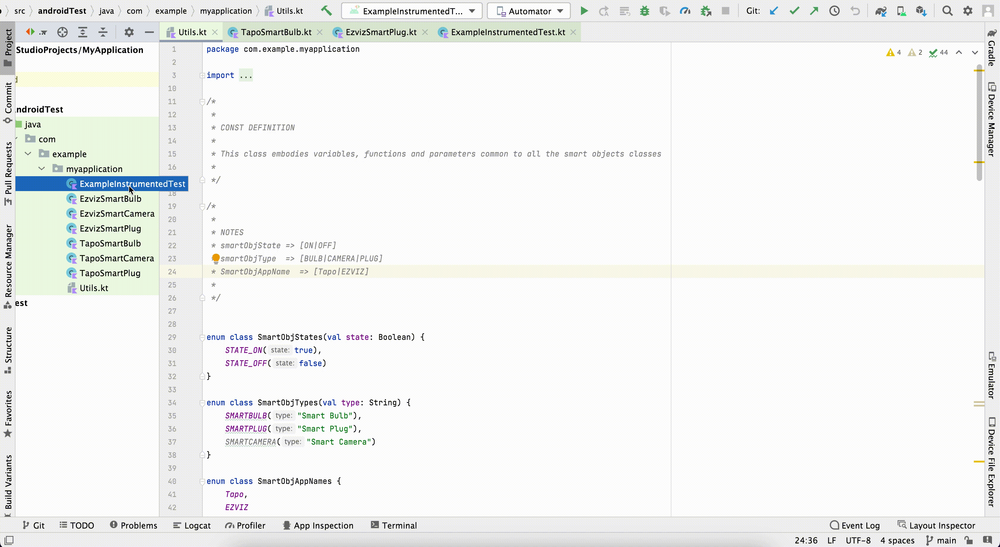
\
After the test had finished, connect with a browser on the management console webpage of your router and disable tcpdump traffic capturing.
\
Connect through ssh to the router and download the pcap trace file in order to perform further analysis.
### UTILITY COMMANDS DURING TEST
During the AndroidTest execution you can see what will be written on the log file using these commands inside a terminal session:
- `adb shell`
- `cd /sdcard/Documents/` or `cd /storage/emulated/0/Documents`
- `tail -f gtfile.txt` (Ctrl-C to exit)

## 11. GROUNDTRUTH FILE EXTRACTION
Command to get the file from the emulated android device:
``` bash
adb pull /storage/emulated/0/Documents/gtfile.txt
```
## 12. GROUNDTRUTH FILE CONVERSTION
Convert gtfile.txt to gtfile.csv in order to be easily parsed and analyzed by python pandas framework.
Exploit the python script [link](https://github.com/rhacrsse/IOT-Forensics-Android-UI-Automation-Testing/blob/main/WIP/txt_to_csv.py). You have to copy the script on your local laptop and run it from your terminal using the syntax:
``` bash
cd SCRIPT_PATH
./txt_to_csv.py SOURCE_PATH DESTINATION_PATH
```  
where:
- `SCRIPT_PATH is the absolute path where you have downloaded the script.`
- `SOURCE_PATH is the absolute path of the gtfile.txt that you have extracted from the emulator.`
- `DESTINATION_PATH is the absolute path of where you want to store the gtfile.csv file converted.`
